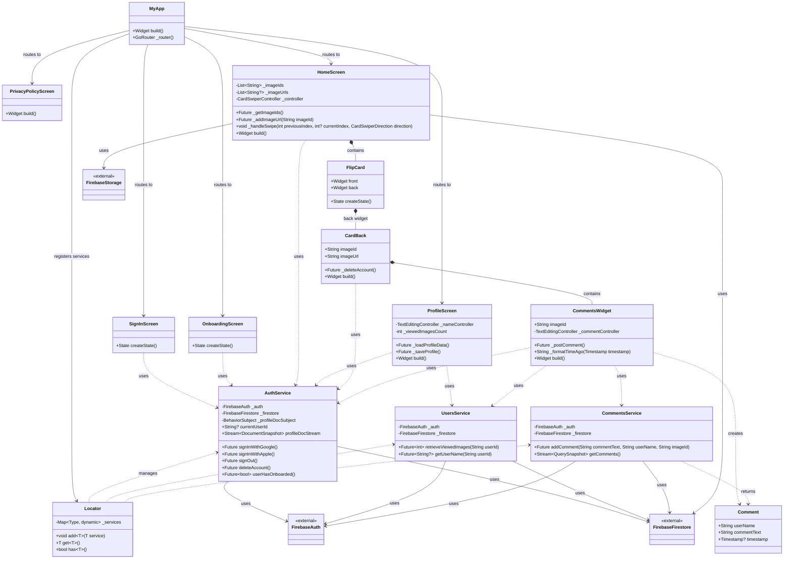

# TindArt Class Diagram

## Overview

This diagram shows the class structure and relationships in the TindArt application, a Flutter/Dart mobile app for discovering and rating artwork through a Tinder-like swiping interface.



## Architecture Patterns

### Service Locator Pattern

The app uses a custom `Locator` class for dependency injection:

- Services are registered in `main.dart`
- Accessed globally via `locate<T>()` function
- Provides type-safe service retrieval

### Layer Architecture

```sh

┌─────────────────────────────────────┐
│         UI Layer (Screens)          │
│  SignInScreen, HomeScreen, etc.     │
└──────────────┬──────────────────────┘
               │
┌──────────────▼──────────────────────┐
│      Widget Layer (Components)      │
│   FlipCard, CardBack, CommentsWidget│
└──────────────┬──────────────────────┘
               │
┌──────────────▼──────────────────────┐
│        Service Layer                │
│ AuthService, UsersService,          │
│ CommentsService                     │
└──────────────┬──────────────────────┘
               │
┌──────────────▼──────────────────────┐
│      Firebase Backend               │
│  Auth, Firestore, Storage           │
└─────────────────────────────────────┘
```

## Key Data Flows

### Authentication Flow

```sh
SignInScreen → AuthService → Firebase Auth → main.dart Router
                                              ├─→ OnboardingScreen (first time)
                                              └─→ HomeScreen (returning user)
```

### Swipe & Comment Flow

```sh
HomeScreen → FlipCard (double-tap) → CardBack → CommentsWidget
                                                      ├─→ UsersService (get username)
                                                      └─→ CommentsService (add/stream comments)
                                                            └─→ Firestore (real-time updates)
```

### Profile Management Flow

```sh
ProfileScreen ─→ UsersService ─→ Firestore (read/write profile)
              └─→ AuthService ─→ Firestore (get user data)
```

## Firestore Collections

| Collection | Document ID | Purpose |
|------------|-------------|---------|
| `profiles` | userId | User profile data (name) |
| `preferences` | userId | User swipe history (liked/disliked image IDs) |
| `image-docs` | imageId | Image metadata and statistics |
| `doc-id-lists` | various | Randomized image ID lists for discovery |
| `comments` | auto-generated | User comments on images |

## State Management

- **Local State**: StatefulWidget with setState
- **Global State**: Service Locator pattern
- **Reactive Streams**:
  - RxDart BehaviorSubject in AuthService
  - Firestore snapshots for real-time data
- **Persistence**: SharedPreferences for onboarding flag

## Key Technologies

- Flutter/Dart framework
- Firebase (Auth, Firestore, Storage, Functions, Analytics, Crashlytics)
- GoRouter for navigation
- RxDart for reactive programming
- flutter_card_swiper for swipe UI
