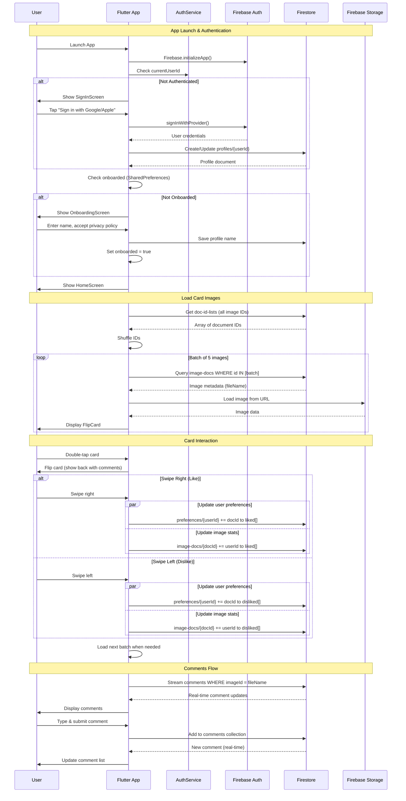
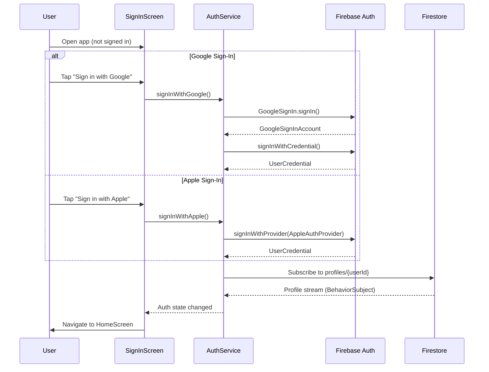
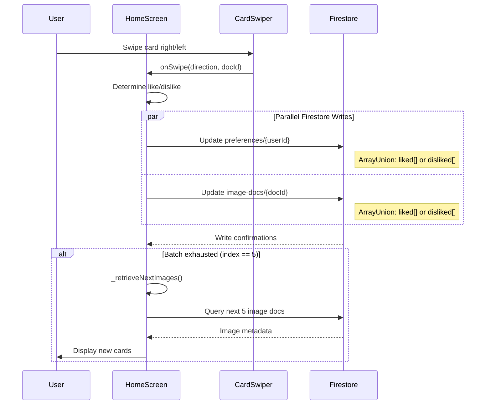
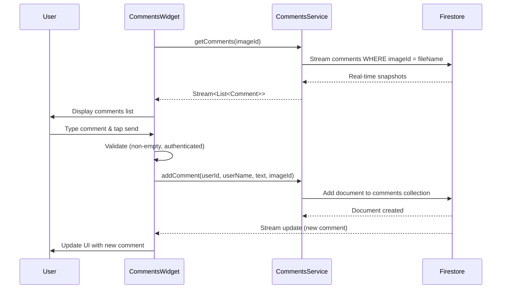
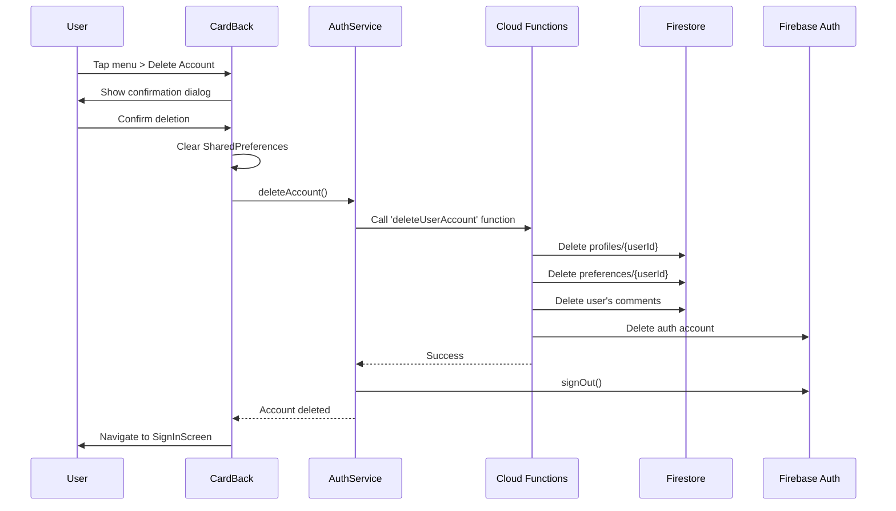
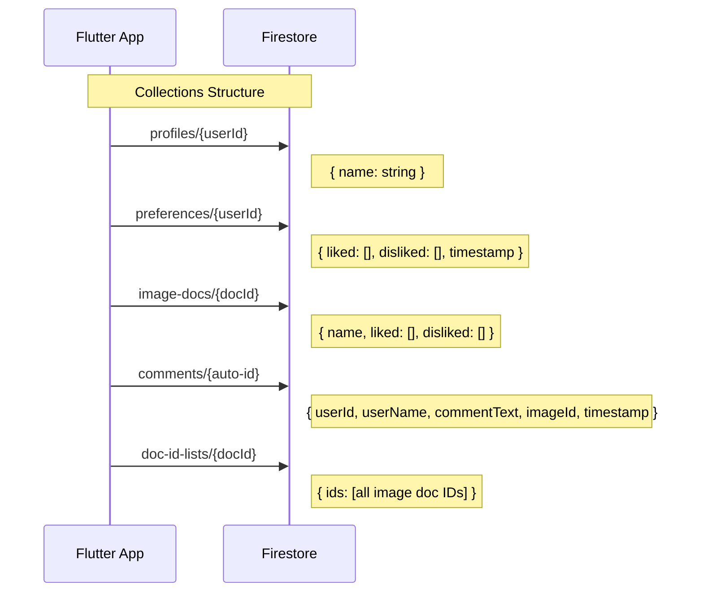

# TindArt Sequence Diagram

## Main Application Flows

```mermaid
sequenceDiagram
    participant U as User
    participant App as Flutter App
    participant Auth as AuthService
    participant FB as Firebase Auth
    participant FS as Firestore
    participant Storage as Firebase Storage

    Note over U,Storage: App Launch & Authentication
    U->>App: Launch App
    App->>FB: Firebase.initializeApp()
    App->>Auth: Check currentUserId

    alt Not Authenticated
        App->>U: Show SignInScreen
        U->>App: Tap "Sign in with Google/Apple"
        App->>FB: signInWithProvider()
        FB-->>App: User credentials
        App->>FS: Create/Update profiles/{userId}
        FS-->>App: Profile document
    end

    App->>App: Check onboarded (SharedPreferences)
    alt Not Onboarded
        App->>U: Show OnboardingScreen
        U->>App: Enter name, accept privacy policy
        App->>FS: Save profile name
        App->>App: Set onboarded = true
    end
    App->>U: Show HomeScreen

    Note over U,Storage: Load Card Images
    App->>FS: Get doc-id-lists (all image IDs)
    FS-->>App: Array of document IDs
    App->>App: Shuffle IDs

    loop Batch of 5 images
        App->>FS: Query image-docs WHERE id IN [batch]
        FS-->>App: Image metadata (fileName)
        App->>Storage: Load image from URL
        Storage-->>App: Image data
        App->>U: Display FlipCard
    end

    Note over U,Storage: Card Interaction
    U->>App: Double-tap card
    App->>U: Flip card (show back with comments)

    alt Swipe Right (Like)
        U->>App: Swipe right
        par Update user preferences
            App->>FS: preferences/{userId} += docId to liked[]
        and Update image stats
            App->>FS: image-docs/{docId} += userId to liked[]
        end
    else Swipe Left (Dislike)
        U->>App: Swipe left
        par Update user preferences
            App->>FS: preferences/{userId} += docId to disliked[]
        and Update image stats
            App->>FS: image-docs/{docId} += userId to disliked[]
        end
    end
    App->>App: Load next batch when needed

    Note over U,Storage: Comments Flow
    App->>FS: Stream comments WHERE imageId = fileName
    FS-->>App: Real-time comment updates
    App->>U: Display comments

    U->>App: Type & submit comment
    App->>FS: Add to comments collection
    FS-->>App: New comment (real-time)
    App->>U: Update comment list
```

## Detailed Flows

### Authentication Flow

```mermaid
sequenceDiagram
    participant U as User
    participant SI as SignInScreen
    participant Auth as AuthService
    participant FB as Firebase Auth
    participant FS as Firestore

    U->>SI: Open app (not signed in)

    alt Google Sign-In
        U->>SI: Tap "Sign in with Google"
        SI->>Auth: signInWithGoogle()
        Auth->>FB: GoogleSignIn.signIn()
        FB-->>Auth: GoogleSignInAccount
        Auth->>FB: signInWithCredential()
        FB-->>Auth: UserCredential
    else Apple Sign-In
        U->>SI: Tap "Sign in with Apple"
        SI->>Auth: signInWithApple()
        Auth->>FB: signInWithProvider(AppleAuthProvider)
        FB-->>Auth: UserCredential
    end

    Auth->>FS: Subscribe to profiles/{userId}
    FS-->>Auth: Profile stream (BehaviorSubject)
    Auth-->>SI: Auth state changed
    SI->>U: Navigate to HomeScreen
```

### Card Swipe Flow

```mermaid
sequenceDiagram
    participant U as User
    participant HS as HomeScreen
    participant CS as CardSwiper
    participant FS as Firestore

    U->>CS: Swipe card right/left
    CS->>HS: onSwipe(direction, docId)

    HS->>HS: Determine like/dislike

    par Parallel Firestore Writes
        HS->>FS: Update preferences/{userId}
        Note right of FS: ArrayUnion: liked[] or disliked[]
    and
        HS->>FS: Update image-docs/{docId}
        Note right of FS: ArrayUnion: liked[] or disliked[]
    end

    FS-->>HS: Write confirmations

    alt Batch exhausted (index == 5)
        HS->>HS: _retrieveNextImages()
        HS->>FS: Query next 5 image docs
        FS-->>HS: Image metadata
        HS->>U: Display new cards
    end
```

### Comments Flow

```mermaid
sequenceDiagram
    participant U as User
    participant CW as CommentsWidget
    participant CS as CommentsService
    participant FS as Firestore

    CW->>CS: getComments(imageId)
    CS->>FS: Stream comments WHERE imageId = fileName
    FS-->>CS: Real-time snapshots
    CS-->>CW: Stream<List<Comment>>
    CW->>U: Display comments list

    U->>CW: Type comment & tap send
    CW->>CW: Validate (non-empty, authenticated)
    CW->>CS: addComment(userId, userName, text, imageId)
    CS->>FS: Add document to comments collection
    FS-->>CS: Document created
    FS-->>CW: Stream update (new comment)
    CW->>U: Update UI with new comment
```

### Account Deletion Flow

```mermaid
sequenceDiagram
    participant U as User
    participant CB as CardBack
    participant Auth as AuthService
    participant CF as Cloud Functions
    participant FS as Firestore
    participant FB as Firebase Auth

    U->>CB: Tap menu > Delete Account
    CB->>U: Show confirmation dialog
    U->>CB: Confirm deletion

    CB->>CB: Clear SharedPreferences
    CB->>Auth: deleteAccount()
    Auth->>CF: Call 'deleteUserAccount' function

    CF->>FS: Delete profiles/{userId}
    CF->>FS: Delete preferences/{userId}
    CF->>FS: Delete user's comments
    CF->>FB: Delete auth account

    CF-->>Auth: Success
    Auth->>FB: signOut()
    Auth-->>CB: Account deleted
    CB->>U: Navigate to SignInScreen
```

## Firestore Data Flow

```mermaid
sequenceDiagram
    participant App as Flutter App
    participant FS as Firestore

    Note over App,FS: Collections Structure

    App->>FS: profiles/{userId}
    Note right of FS: { name: string }

    App->>FS: preferences/{userId}
    Note right of FS: { liked: [], disliked: [], timestamp }

    App->>FS: image-docs/{docId}
    Note right of FS: { name, liked: [], disliked: [] }

    App->>FS: comments/{auto-id}
    Note right of FS: { userId, userName, commentText, imageId, timestamp }

    App->>FS: doc-id-lists/{docId}
    Note right of FS: { ids: [all image doc IDs] }
```
